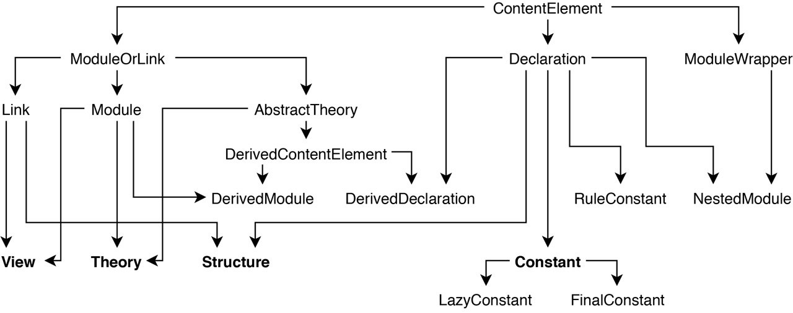

**[`api.ContentElement`](apidoc://info.kwarc.mmt.api.ContentElement)** can be roughly separated into two categories - **declarations** (constants and structures - includes are a special case of structures) and **modules** (theories and views). Both declarations can be **links** between two theories (structures and views) and can be a **ContainerElement** containing declarations (declared theories, structures and views). It provides the `foreachDeclaration` method that takes a function argument and applies it to all content elements recursively contained within it (including itself). The `path` method returns a `ContentPath`.

### General

* **[`modules.ModuleOrLink`](apidoc://info.kwarc.mmt.api.modules.ModuleOrLink)** is the trait governing all content elements that contain declarations (such as theories, views, structures). It provides the following useful methods:
  * `add` adds a new Declaration to the body.
  * `get` takes a LocalName and returns the declaration of that name. If no declaration by that name exists, it throws an error. The method `getO` does not, but returns an `Option[Declaration]` instead.
  * `declares` takes a `LocalName` and returns a `bool` indicating, whether a declaration by that name exists in the body.
  * `delete` takes a `LocalName` and deletes the declaration by that name from the body.
  * `update` takes a `Declaration` and adds it to the body, if no declaration by that name already exists, or replaces the existing one otherwise.
  * `getDeclarations` returns a `List[Declaration]` of all declarations in the body.
All final extensions of `ModuleOrLink` can be *declared* or *defined*. Declared Modules/Links have no definiens and contain primitive declarations. Defined Modules/Links have a definiens (e.g. a theory expression) that can be *elaborated into* a list of declarations. In either case, the (primitive or elaborated) declarations are accessed via the above methods.
* **[`modules.Link`](apidoc://info.kwarc.mmt.api.modules.Link)** is the trait for theory morphisms like views and structures. It has the methods `from` and `to` (returning `Term`) for domain and codomain, `codomainAsContext` and `toTerm`.

### Modules

* **[`modules.Module`](apidoc://info.kwarc.mmt.api.modules.Module)** is the top level data structure for theories and views. The `path` method returns `MPath`. [`DeclaredModule`](apidoc://info.kwarc.mmt.api.modules.DeclaredModule) extends `Module` with a `Body`.
* **[`modules.Theory`](apidoc://info.kwarc.mmt.api.modules.Theory)** is the data structure representing theories. The class constructor takes as arguments the document/namespace containing the theory (`DPath`), its name (`LocalName`) and an optional meta theory (`Option[MPath]`).
  
  `Theory` provides the following useful methods:

  * `getConstants` yields those declarations in the body, that are constants (as `List[Constant]`).
  * `getIncludes` yields a `List[MPath]` of the included theories, including the meta theory. `getIncludesWithoutMeta` does the same without the meta theory.
  * `getNamedStructures` yields a `List[Structure]` of those structures that are *not* plain includes.
* **[`modules.View`](apidoc://info.kwarc.mmt.api.modules.View)** simply combines `Link` and `Module`.

### Declarations

* **[`symbols.Declaration`](apidoc://info.kwarc.mmt.api.symbols.Declaration)** represents everything on the declaration level - this entails constants, structures, derived declarations and nested modules. The `home` method returns the containing module (as `Term`). The `path` method returns `GlobalName`.
* **[`symbols.Constant`](apidoc://info.kwarc.mmt.api.symbols.Constant)** represents a constant declaration. Constants are ultimately instantiated with the subclass [`FinalConstant`](apidoc://info.kwarc.mmt.api.symbols.FinalConstant). Constants use `TermContainer`s to store their type and definiens (in their different states `read`, `parsed` and `analyzed`), which can be accessed by the methods `tpC` (for types) and `dfC` (for definitions). The methods `tp` and `df` circumvent the containers and directly yield their (ideally fully analyzed) type or definiens as `Option[Term]`.

  The helper object [`symbols.Constant`](apidoc://info.kwarc.mmt.api.symbols.Constant$) has an apply method to conveniently create new instances of `FinalConstant`. It takes as arguments the containing home module (`Term`), the name of the constant (`LocalName`), and optionally aliases (`List[LocalName]`), type (`Option[Term]`), definition (`Option[Term]`), role (`Option[String]`) and notation (`NotationContainer`, by default a new empty one).
* **[`symbols.Structure`](apidoc://info.kwarc.mmt.api.symbols.Structure)** combines `Link` with `Declaration`. It has a `boolean` value `isInclude` signifying whether the structure is a simple theory include.
 
  The helper objects [`symbols.Structure`](apidoc://info.kwarc.mmt.api.symbols.Structure$) and [`symbols.SimpleStructure`](apidoc://info.kwarc.mmt.api.symbols.SimpleStructure$) add convenient apply/unapply methods, where `Simple` indicates the case where the domain is an `MPath` (as opposed to a complex [term](objects.html) representing a theory expression). The helper objects [`symbols.Include`](apidoc://info.kwarc.mmt.api.symbols.Include$) and [`symbols.PlainInclude`](apidoc://info.kwarc.mmt.api.symbols.PlainInclude$) offer apply/unapply methods for theory inclusions.

### Derived Content Elements

